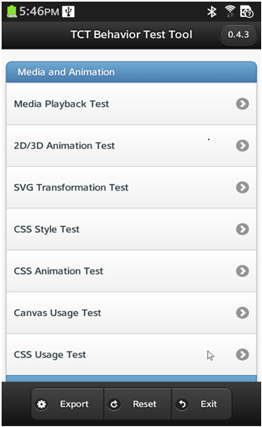
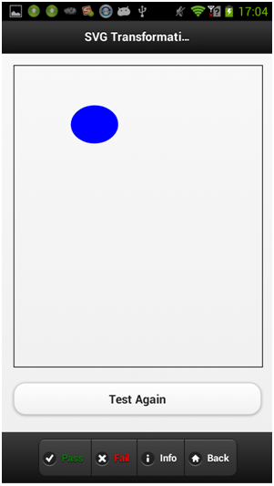
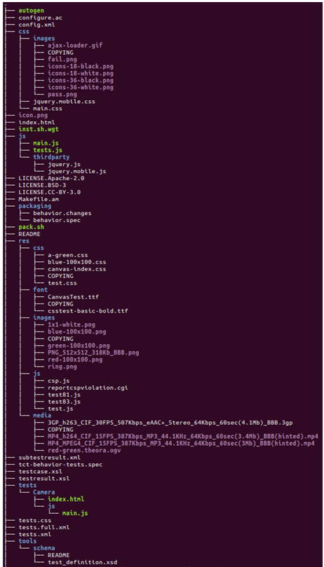
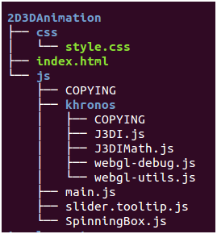

# Behavior Test Tool Developer Guide

## 1. Introduction

This document provides development information about Behavior Test Tool, including: Overview, UI and Source Code Structure Introduction, How to Add New Test etc.

## 2. Overview

This document guides you as you contribute test cases to the Behavior Test Tool. The tool itself is developed using the jQuery Mobile framework, so the test case development should follow general principles of the jQuery Mobile guidelines. See [http://jquerymobile.com/](http://jquerymobile.com/). Also, to seamlessly integrate tests into the tool's framework, a test case should follow the behavior test tool's rules. Finally, the whole tool will be packaged as one widget file and will run on a target device.

### 2.1 User Interface

The Behavior Test Tool UI is shown below:

**Home UI**

Figure 2‑1-1. Behavior Test Tool Home Page

- Header Bar: Show behavior test tool title and version.
- Test List: Show on tests components, test list and test result status.
- Footer Bar:

  - Export Button: Save the test result XML file to the Tizen file system. This is full path that includes both location and file name: /opt/usr/media/Documents/tct-behavior-tests\_{timestamp}.result.xml.
  - Reset Button: Reset test result.
  - Exit Button: Quit.

**Test Case UI**

Figure 2‑2-2. Behavior Test Tool Test Case Page

- Header Bar: Show test case name in the title.
- Main Content: test UI
- Footer Bar: has 4 buttons

  - **Pass**: Save "Pass" result and exit test
  - **Fail**: Save "Fail" result and exit test
  - **Info**: Show test description information
  - **Exit**: Exit test and back to home page.

### 2.2 Source code structure

Figure 2-2 shows the source code structure.

Figure 2‑2. The source code structure

Key files, folders, and images are:

- **config.xml**: Behavior test tool's web app's configuration file.
- **index.html**: Behavior test tool's web app's main page entry.
- **icon.png**: Behavior test tool's web app's icon, should be shown on Tizen home screen.
- **tests.xml**: Behavior test tool's subtest list information file.
- **pack.sh**: Behavior test tool's packing shell script.
- **inst.sh.apk**: The shell script for installing APK package on Android.
- **inst.sh.ivi**: The shell script for installing XPK package on Tizen IVI.
- **inst.sh.wgt**: The shell script for installing WGT package on Tizen Mobile.
- **inst.sh.xpk**: The shell script for installing XPK package on Tizen Mobile.
- **css/**: Tool's main CSS file tests: common CSS file, third party CSS files, and images folder.
- **js/**: Tool's main JS file tests: common JS file and third party JS files.
- **tests/**: Folder of subtests files.
- **res/**: Folder of common resources.
- **tests/template/**: Test developing template for case developer reference.

## 3 Test development

### 3.1 Coding Style

Refer to the `Coding_Style_Guide_CheatSheet.md`.

- `Test ID`: shall be the same as test folder name.
- `Capability`: check the Tizen device HW capability.

### 3.2 Adding a test entry in the Home UI

In the latest behavior tests framework, we start using tests.xml to record test information. You can add a new test case to the tests.xml file and the behavior framework will automatically load the tests.xml file to create a test list view in the main UI.

The tests.xml format is just like the XML scheme of Tizen WebAPI/WRT tests. For example, the test case ID needs to be unique and the test's folder name should be the same as the test case ID. The test folder name (test ID) and the XML can have some special rules. Currently there is a rule for avoiding use of some special characters (such as space). You can use tools/schema/test\_definition.xsd to verify your tests.xml after modifications.

As stated earlier, the "capability" tag be added for Tizen device HW capability checking. If a tests need capability checking, you need add a sub tag "<capability name="your_capability_name"/\>" to this "testcase" tag of tests.xml file. If a mandatory feature is not present, this tests entry of home UI will be marked as black background.

### 3.3 Adding test code resources to the test folder

Take test "2D3DAnimation" as an example:

Figure 3‑1. Test code and resources structure

- Create test sub folder such as "2D3DAnimation" under "tests" folder, should be the same with test case id in tests.xml file.
- **index.html**: the test main page html file.

  - Test developer always need use the template tests for test developing so that you can have a unified style and can use common JS libraries.

Example:

    <meta charset="utf-8">
    <meta name="viewport" content="initial-scale=1.0, maximum-scale=1.0, width=device-width">
    <link rel="stylesheet" href="../../css/jquery.mobile.css">
    
    
    
    

      <h1 id="main_page_title"></h1>
    

    

        Hello World !
    

    

    

    

      
Test Info

    

- Test developer always need import following css and js files to you test:
- Do not need add header title as test.js will add title to header automatically.
- Do not need add footer bar as test.js will insert the footer for each tests page.

Example:

    <link rel="stylesheet" href="../../css/jquery.mobile.css">
    

- "../../js/tests.js" and "../../js/tests.css": Provide JS APIs and CSS style need by test footer Bar, your need import it in your test page html file always. The JS provide following APIs:

  - Update header title automatically.
  - Insert the footer bar automatically.
  - getAppName API to return your tests APP name.
  - EnablePassButton/DisablePassButton to indicate the testing process based on tests needs.

- Test Info: Case developer can add the test info to the popup div in test home page.

Example:

    

    
Your test description/test steps/PASS&FAIL conditions.

### 3.4 Updating the configuration file

All test cases share one configuration file. You can update the config.xml file if needed, but please be cautious.

### 3.5 Packing

You can use pack.sh to create your zip file.

