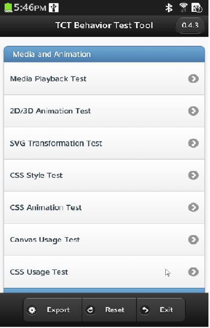
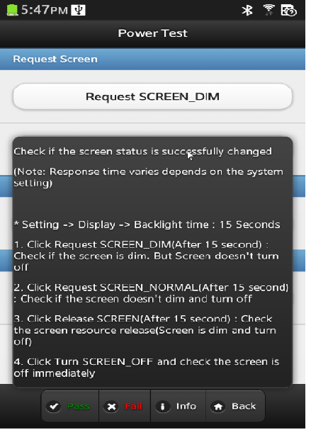

# Behavior Test Tool User Guide

## 1. Introduction

This document provides comprehensive information about Behavior Test Tool, including the following: Overview, Installation and Deployment, Test Execution and Report.

Note that the `tester` in this guide is the user name of the device under test. It just means a normal username for multiuser support.

## 2. Overview

Behavior Test Tool is a device behavior checker that uses jQuery. It is a major component of the Tizen Compliance Tests tool set.

Behavior Test Tool has these features:

- A list of behaviors you can test, with information about test cases
- Test cases for checking and evaluating the behavior of a device
- Automatically generated test reports you can view and save for further analysis

## 3. Install Crosswalk

- Install crosswalk on Tizen

  - Download crosswalk from here

        https://download.01.org/crosswalk/releases/crosswalk/tizen-ivi/canary/<version\>/crosswalk-<version\>.i686.rpm

        https://download.01.org/crosswalk/releases/tizen-extensions-crosswalk/tizen-ivi/canary/<version\>/tizen-extensions-crosswalk-<version\>.i686.rpm

  - Deploy crosswalk to Tizen device

        $ sdb push crosswalk-<version\>.i686.rpm /opt/home/tester

        $ sdb push tizen-extensions-crosswalk-<version\>.i686.rpm /opt/home/tester

        $ sdb shell "rpm -ivh /opt/home/tester/crosswalk-<version\>.i686.rpm"

        $ sdb shell "rpm -ivh /opt/home/tester/tizen-extensions-crosswalk-<version\>.i686.rpm"

- Install crosswalk on Android

  - Download crosswalk from here

        https://download.01.org/crosswalk/releases/crosswalk/android/canary/<version\>/x86/crosswalk-apks-<version\>-x86.zip

  - Deploy crosswalk to Android device

        $ unzip crosswalk-apks-<version\>-x86.zip -d /path/to/

        $ adb install /path/to/crosswalk-apks-<version\>-x86/XWalkRuntimeLib.apk

## 4. Deploy tinyweb

1. Deploy tinyweb on Tizen

  - Make binaries for tinyweb from source code in Github

        $ git clone git@github.com:testkit/tinyweb.git

        $ cd tinyweb && make

        Note: The generated tinyweb type depends on your OS system type (32/64 bit).

  - Deploy binaries to TIZEN device

        $ sdb shell "mkdir -p /opt/usr/media/tct/"

        $ sdb push tinyweb /opt/home/tester/

        $ sdb shell "chmod a+x /opt/home/tester/tinyweb"

        $ sdb push cgi-getcookie /opt/home/tester/

        $ sdb shell "chmod a+x /opt/home/tester/cgi-getcookie"

        $ sdb push cgi-getfield /opt/home/tester/

        $ sdb shell "chmod a+x /opt/home/tester/cgi-getfield"

        $ sdb push server.pem /opt/home/tester/

        $ sdb shell "chmod 666 /opt/home/tester/server.pem"

        $ sdb shell "ln -s /usr/lib/libssl.so.1.0.0 /opt/home/tester/libssl.so"

        $ sdb shell "ln -s /usr/lib/libcrypto.so.1.0.0 /opt/home/tester/libcrypto.so"

  - Launch tinyweb

        $ DPATH=`sdb shell "printenv PATH"`

        $ timeout 5 sdb shell "env LD\_LIBRARY\_PATH=/opt/home/tester PATH=$DPATH:/opt/home/tester tinyweb -ssl\_certificate /opt/home/tester/server.pem -document\_root /opt/usr/media/tct/ -listening\_ports 80,8080,8081,8082,8083,8443s; sleep 3s"

2. Deploy tinyweb on Android

  - Make binaries for tinyweb from source code in Github

        $ git clone git@github.com:testkit/tinyweb.git

        $ cd tinyweb/android/native/jni/ && /path/to/android-ndk-<version\>/ndk-build

  - Copy tinyweb/android/native/libs/ to folder tinyweb/android/assets/system/libs/

        For example:

        $ cp -r /path/to/tinyweb/android/native/libs/ /path/to/tinyweb/android/assets/system/libs/

  - Import project tinyweb to Android developer Tool by location tinyweb /android
  - Export the android project to APK and install APK to android device

        $ adb install /path/to/tinyweb/bin/TinywebTestService.apk

  - Launch tinyweb by clicking the tinyweb app icon in launcher

## 5 Installation Behavior Test Tool

- Pack Behavior Test Tool

    Please see **Web\_Test\_Suite\_Packaging\_Guide** , Chapter 3 "_Pack Web Test Suite Packages_", to choose a suitable mode package.

    Note: For Android device, only embedded mode APK package is supported.

- Install Behavior Test Tool

    On Tizen:

    $ sdb push tct-behavior-tests-x.x.x-x.xpk.zip/opt/usr/media/tct/

    $ sdb shell

    $ cd /opt/usr/media/tct/

    $unzip tct-behavior-tests-x.x.x-x.xpk.zip

    $/opt/usr/media/tct/opt/tct-behavior-tests/inst.sh

    On Android:

    $unzip tct-behavior-tests-x.x.x-x.apk.zip

    $ ./opt/tct-behavior-tests/inst.sh

## 6. Preparing To Test

The home page in which allBehavior Test Tool test cases are listed is shown below:

Figure 5‑1. Behavior Test Tool Home Page

The header bar shows the Behavior Test Tool title and version.

The test list in the center shows components and the tests for them. When you perform a test, the result status also appears in this area.

The footer bar has buttons for working with the test results:

- **Export**: Save the test result XML file to the file system. This is default full path that includes both location and file name: /opt/usr/media/Documents/tct-behavior-tests.result.xml.

Note: Currently export result is blocked by crosswalk implement.

- **Reset**: Reset the test results.
- **Exit**: Quit.

## 7. Executing Tests

- Click the Info button to view the test case description, and perform the test according to it.

Figure 6‑1. Behavior Test ToolTest Case Info Page

- Compare the test result with the expected result, then click **Pass** or **Fail** to update the test result on the Home page.

## 8. Viewing theReport

To generate the result XML at the specific location, click Export. You can view the summary information, including the case title and result.

