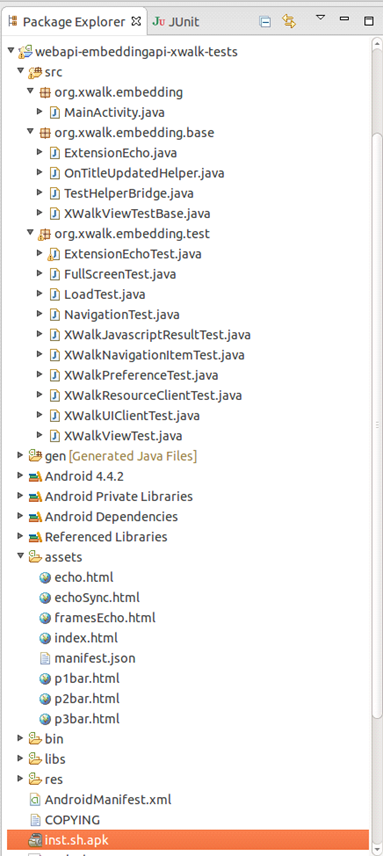
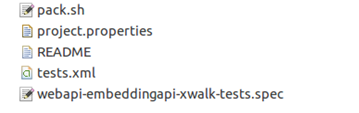

# EmbeddingAPI Test Suite Developer Guide

## Introduction

This document provides development information about EmbeddingAPI Test Suite, including the following: Overview, Build a development environment, Source Code Structure Introduction, Naming Convention, and How to Add New Test etc.

## Overview

This document guides you as you contribute test cases to the EmbeddingAPI Test Suite. The cases is developed using the instrumentation framework.

Test developers are supposed to have set up the host and target:

- Setup Ubuntu (12.04 64bit) Host for the Test Environments.
- Ensure that you have set up your host environment for Android development.
- set up an Android device to deploy the application to.
- Ensure that you have installed the necessary ADT componentsfor your host.

## Build a development environment

### 1. How to create an application with the embedding api

Refer the following link for the way to create an application with the embedding api. the EmbeddingAPI Test Suite is built like that.

[https://crosswalk-project.org/#documentation/embedding\_crosswalk/Reference-Crosswalk-webview-from-your-project](https://crosswalk-project.org/#documentation/embedding_crosswalk/Reference-Crosswalk-webview-from-your-project)

### 2. Import EmbeddingAPI Source Code into ADT.

- Get the EmbeddingAPI Source Code from the following link:[https://github.com/crosswalk-project/crosswalk-test-suite/tree/master/embeddingapi](https://github.com/crosswalk-project/crosswalk-test-suite/tree/master/embeddingapi),Then import the EmbeddingAPI test project into ADT.

  - Open ADT.
  - Select File > New>Project..., then Android>Android Project From Existing Code.
  - Set Root Directory to the path of the embedding-api-android-tests/directory you extracted.
  - Click Finish. The imported project will now be visible in the Package Explorer.

- The next step is to add a reference for the Crosswalk webview project to the imported project.Do the following (in ADT):

  - Right-click on the imported project in the Package Explorer and select Properties.
  - Select Android.
  - In the Library tab, click Add. Select the crosswalk-webview-XXX-x86 project and click OK. The imported project should now be linked to the Crosswalk webview project.

- Add the jars in the libs directory, Do the following (in ADT):

  - Right-click on the imported project in the Package Explorer and select Properties.
  - Select Java Build Path.
  - In the Library tab, click Add JARS…, Select the imported project libs subdirectory \*.jar and click OK.

If there is no red fork in the source code of src directory in _Package Explorer_, This step has been done correctly.

## Source code structure

The source code structure is as follows.

 

 

Figure 1. The source code structure

Key files, folders are:

- src fold: All java code is in this fold.
- MainActivity.java: All the embedding test cases share this activity.
- xwalk.embedding.base fold: Some base classes are defined in this fold.
- XwalkViewTestBase.java: All the embeddingAPI test cases extend this class. Common methods that test cases class will call are definded in this class. For example: loadAssetFileAndWaitForTitle(String fileName)
- xwalk.embedding.test fold: All the test cases class files are in this fold.
- assets fold: html, json and javascript, image, css files can be stored in this fold.
- *.html: html files that can be called by java code. For example: loadUrlSync("file:///android\_asset/index.html",null).
- manifest.json: json file that can be called by java code.
- libs folder: All the referenced jars are stored in this fold.
- AndroidManifest.xml: Android framework config file.
- pack.sh: a shell script file to support a test suite package in the type of APK, in .zip, for Android platform.
- test.xml: a mandatory file to describe all test cases for this test suite.

## Test Case Naming Convention

A case contains several subcases. The case is a java class file. The file is named like 'LoadTest', it must end with 'Test'.

A subcase is a method in the test case class file. It must start with 'test'. Like testGetUrl, 'GetUrl' is the embedding API method that will be checked.

## How to add a case for embeddingAPI tests

- New a java class in org.xwalk.embedding.test package, name it with 'XXXTest', and make this class to extend org.xwalk.embedding.base.XWalkViewTestBase class.

Add a new method named 'testXXX', and write code in this method to check the feature in this subcase tests. Like:

    @SmallTest
    public void testGetNavigationItemUrl() {

      try {

        final String url1 = "about:blank";

        final String url2 = "file:///android\_asset/manifest.json";

        loadUrlSync(url1);

        loadUrlSync(url2);

        String url = getNavigationUrlOnUiThread();

        assertEquals(url2, url);

      } catch (Exception e) {

        e.printStackTrace();

        assertTrue(false);

      }

    }

The '@SmallTest' in this code identifies this method is a test method.

- Add one set for this added case in test.xml.

The content is as follows, the test\_set\_src identifies the path of the added case class path.

## How to run the subcases in ADT

Do the following (in ADT):

- set up an Android device to the host with USB interface.
- Right-click on the imported project in the Package Explorer and select Run As.
- Select Android Junit Test
- Choose a running Android device and click OK button.

##Appendix 1 tests.xml
Each test suite package has two dedicated tests.xml files, which defines all test cases in the package.
Note: The .xml files must comply with the rules in the test\_definition.xsd file. For details, see  [https://github.com/testkit/testkit-lite/blob/master/xsd/test\_definition.xsd](https://github.com/testkit/testkit-lite/blob/master/xsd/test_definition.xsd).

Tests.xml Example.

    <?xml version="1.0" encoding="UTF-8"?>
    <?xml-stylesheet type="text/xsl" href="./testcase.xsl"?>
    <test_definition>
      <suite name="embedding-api-android-tests" category="Android embedding APIs">
        <set name="EmbeddingApiTest" type="androidunit">
          <testcase component="Embedding API Test" execution_type="auto" id="LoadTest" purpose="Check if the load related methods are effective." subcases="12">
            <description>
              <test_script_entry>org.xwalk.embedding.test.LoadTest</test_script_entry>
            </description>
          </testcase>
          <testcase component="Embedding API Test" execution_type="auto" id="NavigationHistoryTest" purpose="Check if the view can forward and backward history." subcases="13">
            <description>
              <test_script_entry>org.xwalk.embedding.test.NavigationHistoryTest</test_script_entry>
            </description>
          </testcase>
          <testcase component="Embedding API Test" execution_type="auto" id="XWalkNavigationItemTest" purpose="Check if the view history can get the correct url, title, and original url." subcases="3">
            <description>
              <test_script_entry>org.xwalk.embedding.test.XWalkNavigationItemTest</test_script_entry>
            </description>
          </testcase>
          <testcase component="Embedding API Test" execution_type="auto" id="XWalkViewTest" purpose="Check if the methods of XWalkView interface can be executed correctly." subcases="22">
            <description>
              <test_script_entry>org.xwalk.embedding.test.XWalkViewTest</test_script_entry>
            </description>
          </testcase>
          <testcase component="Embedding API Test" execution_type="auto" id="XWalkUIClientTest" purpose="Check if the methods of XWalkUIClient interface can be executed correctly." subcases="17">
            <description>
              <test_script_entry>org.xwalk.embedding.test.XWalkUIClientTest</test_script_entry>
            </description>
          </testcase>
          <testcase component="Embedding API Test" execution_type="auto" id="XWalkResourceClientTest" purpose="Check if the methods of XWalkResourceClient interface can be executed correctly." subcases="6">
            <description>
              <test_script_entry>org.xwalk.embedding.test.XWalkResourceClientTest</test_script_entry>
            </description>
          </testcase>
          <testcase component="Embedding API Test" execution_type="auto" id="XWalkPreferenceTest" purpose="Check if the methods of XWalkPreference interface can be executed correctly." subcases="10">
            <description>
              <test_script_entry>org.xwalk.embedding.test.XWalkPreferenceTest</test_script_entry>
            </description>
          </testcase>
          <testcase component="Embedding API Test" execution_type="auto" id="XWalkJavascriptResultTest" purpose="Check if the methods of XWalkJavascriptResult interface can be executed correctly." subcases="3">
            <description>
              <test_script_entry>org.xwalk.embedding.test.XWalkJavascriptResultTest</test_script_entry>
            </description>
          </testcase>
          <testcase component="Embedding API Test" execution_type="auto" id="FullScreenTest" purpose="Check if the fullScreen related methods are effective." subcases="2">
            <description>
              <test_script_entry>org.xwalk.embedding.test.FullScreenTest</test_script_entry>
            </description>
          </testcase>
          <testcase component="Embedding API Test" execution_type="auto" id="XWalkExtensionTest" purpose="Check if the methods of XWalkExtension interface can be executed correctly." subcases="10">
            <description>
              <test_script_entry>org.xwalk.embedding.test.XWalkExtensionTest</test_script_entry>
            </description>
          </testcase>
        </set>
      </suite>
    </test_definition>

