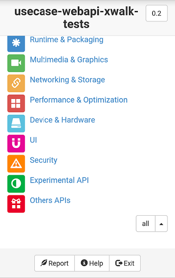
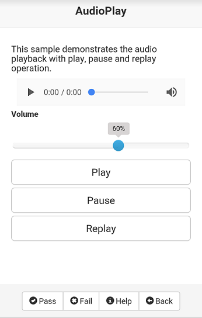

# Usecase Test Suite User Guide

## Overview

This document provides method to run usecase test suite. 

## Install Usecase Test Suite

        $ unzip <package-name>-<version>.zip
        $ cd opt/<test-suite>
        $ ./inst.py

## Run Usecase Test Suite

Take `usecase-webapi-xwalk-tests` as an example, launch app by icon on device,
 the usecase will be sorted by components like:

- The header bar shows the usecase test suite title and version.
- The test list in the center shows components and the tests. When you perform a test,
  the result status also appears in this area.
- The footer bar has buttons for working with the test results:

    - **Report**: Create usecase test report, test result will be reported by summary
       and detail information. 
    - **Help**: The API spec information referenced by usecase.
    - **Exit**: Quit app.

## Execute Usecase Test

Select component in home page, then test usecase following description in each test,
 such as "Multimedia & Graphics" > "AudioPlay":

- **Pass**: Report test result as pas if test result is same with expected result.
- **Fail**: Report test result as fail if test result is different with expected result.
- **Help**: Test purpose, test steps and expected result.
- **Back**: Return to previous page.

## Viewing Test Report

Click **Report** in home page, you can view the summary report and detail report
 including the case id and result.

## Run Usecase Auto Test by Webdriver

- Deploy testkit-lite on Linux

    - Install dependency python-requests (version>1.0)

        $ sudo apt-get install python-pip
        $ sudo pip install requests

    - Install testkit-lite from source code in GitHub

        $ git clone https://github.com/testkit/testkit-lite
        $ cd testkit-lite
        $ sudo python setup.py install

- Deploy Webdriver service on Linux

        $ git clone https://github.com/crosswalk-project/crosswalk-web-driver
        $ cd crosswalk-web-driver/bin
        $ ./xwalkdriver32_20141121

- Install ATIP on Linux

        $ cd crosswalk-test-suite/tools/atip
        $ sudo python setup.py install

- Run auto tests

        $ cd opt/<test-suite>
        $ testkit-lite -f $PWD/tests.xml --comm androidmobile -e XWalkLauncher -k webdriver -o $PWD/result.xml --testprefix=$PWD/../../

- Get test report in `result.xml`

