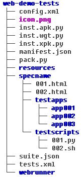
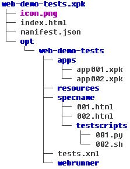

# Overview

To support packaging web test suites on multiple platforms including Windows, here introduces a new web test suite packaging solution to replace previous `pack.sh` and `autoconf` based packaging solution.

With this packaging solution, there are some benefits obviously:

- No need `Makefile.am` for every subdirectory.
- No need `autoconf` because it is hard to build/pack resource on multiple platforms.
- All test suites are able to share one pack tool (`pack.py`); each test suite just needs a special JSON file (`suite.json`) for resource structure.
- All test suites are able to share one `VERSION` file at the top.
- Scalable options for tools/install destination/package source/packing debug ...
- Better experience for log and multiple packing processes.
- Strict error handling.

# Test Suite Resource

Here is a typical web test suite resource structure:



## Test Case and Support Files

This test suite packaging solution has NO impact on the existing test cases and resource files. It may needs some minor changes for the existing files which are improperly structured.

## `tests.xml`

No impact. Still follow the [tests.xml scheme definition](https://github.com/testkit/testkit-lite/blob/master/xsd/test_definition.xsd) specified by [testkit-lite](https://github.com/testkit/testkit-lite) tool.

## `suite.json`

This is one of the main changes of the new web test suite packaging solution. It is a package specification file, which provides the test suite package's architecture in different package types. It will be parsed by the pack tool (`pack.py`) when build web test suite package(s).

| Key | Mandatory? | Description | Example | Note |
| :-- | :--------- | :---------- | :------ | :--- |
| "pkg-name" | No | Package name | `"pkg-name": "web-demo-tests"` |
| "pkg-blacklist" | No | The common black list used by final zip package and top level package app | `"pkg-blacklist":["pack.py", "COPYING"]` | `pack.py` will handle some app framework files by itself, e.g. `icon.png`, `config.xml`, so you just need add those files to this common black list. The value of the list member can support "regular expression", e.g. `test/*.py` will add all files which have `.py` suffix in `test` folder to the black list. |
| "pkg-list" | Yes | The detailed package type which the `pack.py` supported | | The package should be the one of `apk`, `xpk`, `wgt`, `apk-aio`, `cordova`. The package type can share a package json section, e.g. `apk,cordova`, or use single section, e.g. `wgt` |
| "blacklist" | No | The black list used by the parent package or app | `"blacklist":["specname/testapps","specname/testscripts"]` | Effective on relative path， e.g. package's `blacklist` acts on suite folder(in final zip package, is `/`), and package top level app's `blacklist` acts on suite folder(in final zip package, is `/opt/test-suite-name/` folder). But for sub apps' `blacklist`, it act on sub apps source folder(in sub app package, is `/`). The value of the list member can support "regular expression", e.g. `test/*.py` will add all files which have `.py` suffix in `test` folder to the black list. |
| "copylist"  | No | The copy list used by the parent package or app | `"copylist": {"inst.apk.py": "inst.py","specname/testscripts": "specname/testscripts","specname/testscripts/app01/webdriver.xw_android.cfg": "specname/testscripts/app01/webdriver.cfg"} `| Effective on relative path too, just like `blacklist`, but not support "regular expression". Support MARCO `PACK-TOOL-ROOT` to replace the prefix of "relative path", the `PACK-TOOL-ROOT` is the tools path (point out by `--tools` or default `test-suite-name/../../tools`, e.g. `"PACK-TOOL-ROOT/crosswalk/":"crosswalk"` will copy crosswalk folder under tools to `crosswalk` folder of the package/app source tree) |
| "pkg-app" | No | The package's top level app | | Only some WebAPI test packages need this top level app |
| "subapp-list" | No | The black list used by the parent package or app| | The key of the number should be the app's relative path in suite source folder |
| "app-dir" | No | Specify which directory will be packed as a sub app | `"app-dir": "path/to/folder"` | The sub-app will use the key in `subapp-list` if no `app-dir` provided in json by default |
| "app-name" | No | Sub app name | `app01` | The app will use the parent folder name if no `app-name` provided in json |
| "sign-flag" | No| The sign flag of the wgt app| `"sign-flag": "true"` | Only used by wgt package type |
| "install-path" | No| The app's installation folder in the final zip package | `"install-path":"haha/kkkk"`| Will use the `/` of final zip package if no `install-path` provided |
| "hosted-app" | No | Point out if the package app is hosted app | `"hosted-app":"true"` | Only use by package app (`pkg-app`), the `pack.py` will update package app's index.html to point to remote http server webrunner |
| "all-apps" | No | The `pack.py` will pack all sub folders one by one automatically if the value is `true` | `"all-apps": "true"` | The apps' name will use parent folder name |
| "apk-type" | No | Point out the apk type, the type should one of `HOSTEDAPP`, `MANIFEST` and `COMMANDLINE`. The default apk type is `COMMANDLINE`. (1) `"MANIFEST`": will pack apk with default `manifest.json` in sub app folder by `--manifest=` option. (2) `HOSTEDAPP`: will pack apk by `--app-url`. (3) `COMMANDLINE`: will pack apk by `make_apk.py` command line, e.g. `python make_apk.py --package=org.xwalk.calculator_test --name=calculator_test --app-root=/tmp/tog4ffi40m68ri7/calculator_test --app-local-path=index.html --icon=/tmp/tog4ffi40m68ri7/calculator_test/icon.png --mode=embedded --arch=x86` |
| "apk-type":"HOSTEDAPP" | The `HOSTEDAPP` need `test" at the same time |
| "apk-url-opt" | No | Point out value `--app-url` option of `make_apk.py` | `"apk-url-opt":"www.baidu.com"` | Only use by apk type `HOSTEDAPP` |
| "apk-ext-opt" | No | Point out value `--extensions` option of `make_apk.py`, should be the relative path of suite source | `"apk-ext-opt":"haha/kkkk"` |
| "apk-cmd-opt" | No | Point out value `--xwalk-command-line` option of `make_apk.py` | `"apk-cmd-opt":"--disable-webgl --disable-webrtc"` |
| "apk-mode-opt" | No | Point out value `--mode` option of `make_apk.py` | `"apk-mode-opt":"embedded"` | Should be one of `shared` or `embedded`, default value will be the value of `-m` option |
| "apk-arch-opt" | No | Point out value `--arch` option of `make_apk.py` | `"apk-arch-opt":"x86"` | Should be one of `arm` or `x86`, default value will be the value of `-a` option |
| "apk-icon-opt" | No | Point out value `--icon` option of `make_apk.py` | `"apk-icon-opt":""` (if no need of `icon.png`) | Default value will use the `icon.png` under current `app-dir` folder |
| "key-file" | No | Point out key file of `make_xpk.py` | `"key-file":"haha.pem"` | `key.file` is reserved for default xpk packing |
| "embeddingapi-library-name" | No | Point out embeddingapi core library folder name in tools folder | `"embeddingapi-library-name": "crosswalk-webview"` |
| "apk-common-opts" | No | Point out apk extra options| `"apk-common-opts": "--keep-screen-on --enable-remote-debugging"` |

## `pack.py`

This is a Python based pack tool to replace `pack.sh`. It requires `Python 2.7*` on Linux platform only.

```
Usage: ./pack.py -t apk -m shared -a x86

Options:
  -h, --help            show this help message and exit
  -c PKGCFG, --cfg=PKGCFG
                        specify the path of config json file
  -t PKGTYPE, --type=PKGTYPE
                        specify the pkg type, e.g. apk, xpk, wgt ...
  -m PKGMODE, --mode=PKGMODE
                        specify the apk mode, e.g. shared, embedded
  -a PKGARCH, --arch=PKGARCH
                        specify the apk arch, e.g. x86, arm
  -d DESTDIR, --dest=DESTDIR
                        specify the installation folder for packed package
  -s SRCDIR, --src=SRCDIR
                        specify the path of pkg resource for packing
  --tools=PKGPACKTOOLS  specify the parent folder of pack tools
  --notclean            disable the build root clean after the packing
  -v, --version         show this tool's version
  --pkg-version=PKGVERSION
                        specify the pkg version, e.g. 0.0.0.1
```

## `VERSION`

This file with version info only is used by the `pack.py` tool. Normally, the pack tool will go through subdirectories, `../../<test-suite-name>`, `../<test-suite-name>` and `../../<test-suite-name>` one by one, and use the fist `VERSION` file found.


| Key | Mandatory? | Description | Example |
| :-- | :--------- | :---------- | :------ |
| "main-version" | Yes | Package main version | "main-version": "0.0.0.1" |
| "release-version" | Yes | Package release(hotfix) version | "release-version": "1" |


# Packaged Test Suite Structure




Take Ubuntu as a example:

* Before packaging, please install `Python 2.7.*`. Because the default tools subdirectory is `<test-suite-name>/../../tools`, usually you need to copy packaging tools into this subdirectory, or you can use `pack.py` option `--tools` to specify the tools path. For example:

```
$ cd /tmp
$ unzip crosswalk-version.zip
$ mv crosswalk-version <path-to-tools>/crosswalk -a  # Crosswalk `make_apk.py` is here.
$ cp make_xpk.py <path-to-tools>/
$ cp signing <path-to-tools>/ -a  # For WGT signature
$ cp cordova <path-to-tools>/ -a  # For Cordova test suite
```

* Then run `pack.py` to pack test suite package, e.g.:

`$ python pack.py -t apk -m embedded -a x86`

* There is also an option `--notclean` whitch can specify a non-clean temp subdirectory, e.g. `/tmp/<test-suite-name>`. Please note that the `<test-suite-name>` contains 15 random characters plus.

* After packaging, there is a packaged test suite generated, e.g. web-demo-tests-version.apk.zip
